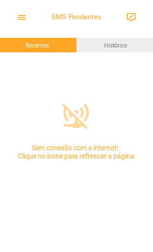
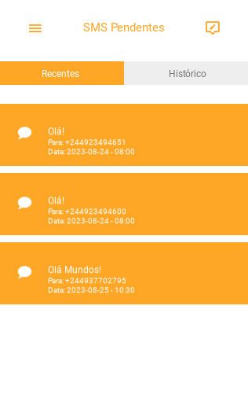
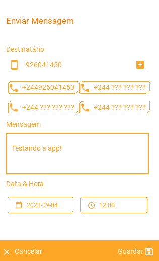
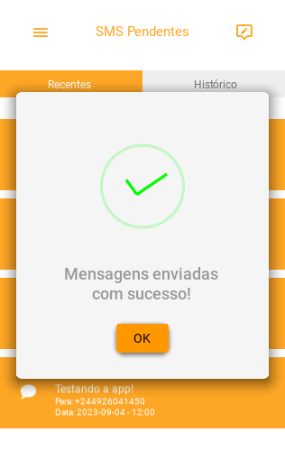

# SMS DeliveryApp

## Screenshots

 
 

## Sobre da App

O **SMS DeliveryApp** é um aplicativo de agendamento e entrega de mensagens.

O objectivo da aplicação é permitir com que as pessoas comuniquem-se por meio de mensagens sem ter que usar créditos de mensagens para isso, mas apenas utilizando dados movéis e ainda podendo enviar mensagem para qualquer pessoa em qualquer parte do mundo.

## Estrutura da App

O **SMS DeliveryApp** está sendo desenvolvido inteiramente em python por agora. Tendo o seu front-end feito com *[KivyMD](https://kivymd.readthedocs.io/)* e o seu back-end feito com *[Flask](https://flask.palletsprojects.com/)*.

'*Para saber mais sobre o back-end da mesma [click aqui]().*'

Copyright - Eliseu Gaspar
